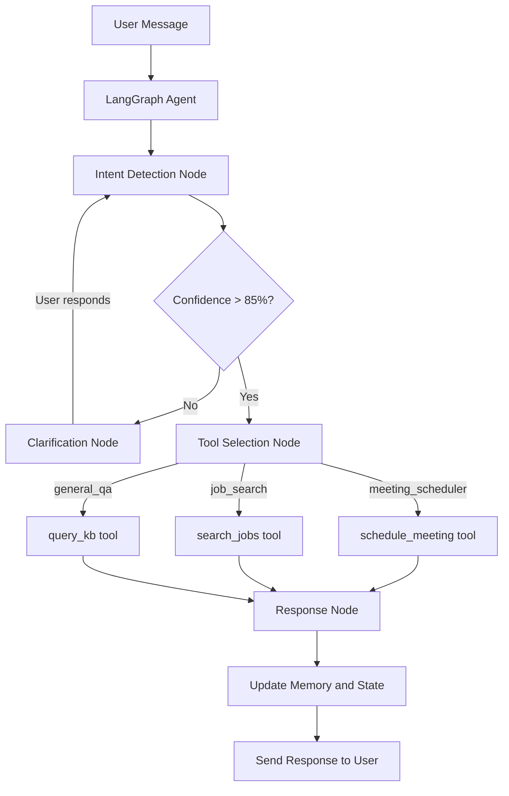
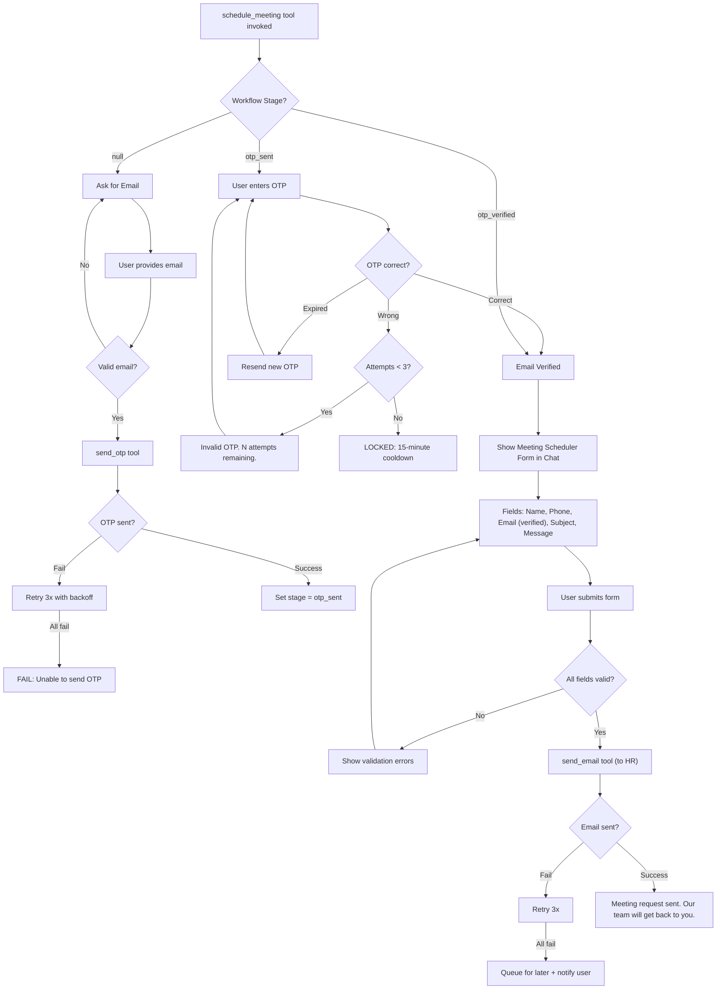
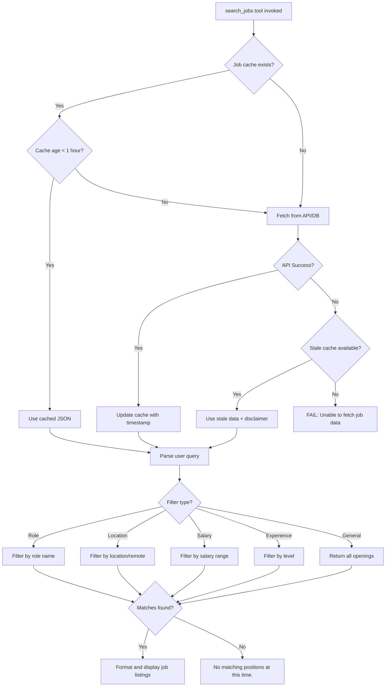
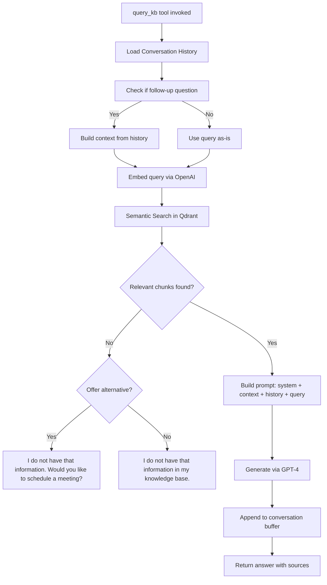
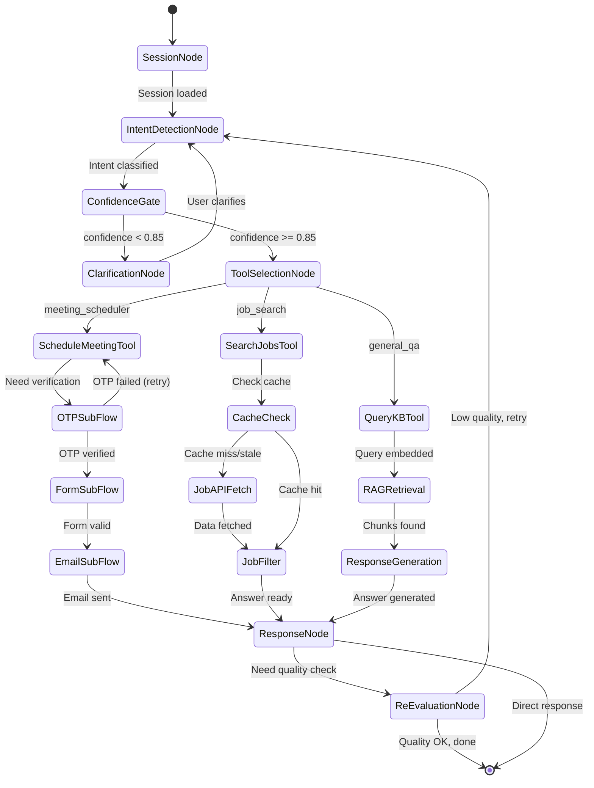
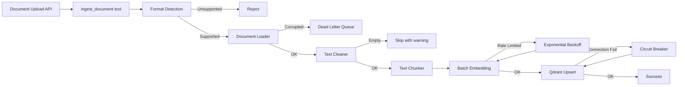
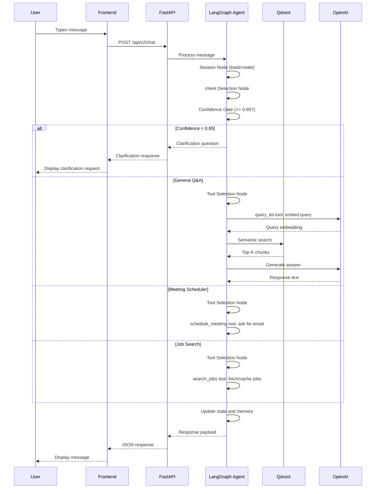

# Multi-Agent Chatbot V2 — Flowcharts

## 1. Master Orchestration Flow

---

## 2. Meeting Scheduler Sub-Flow

---

## 3. Job Search Sub-Flow

---

## 4. General Q&A Sub-Flow

---

## 5. LangGraph State Machine

---

## 6. Ingestion Pipeline

---

## 7. Session Lifecycle

